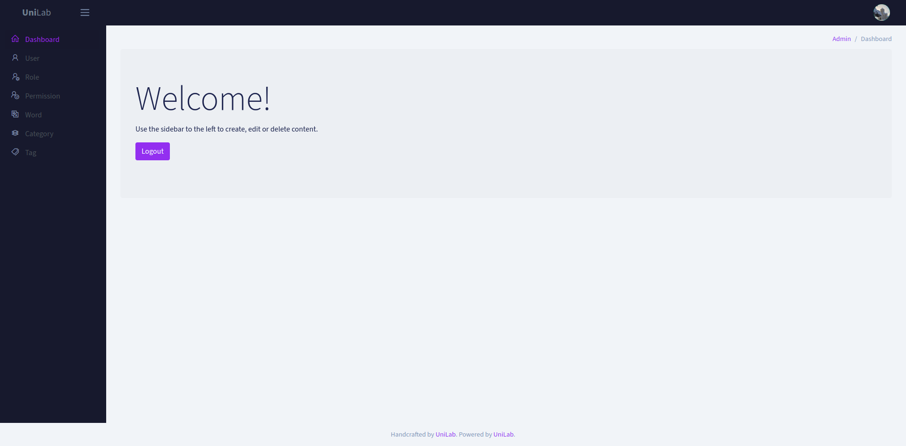
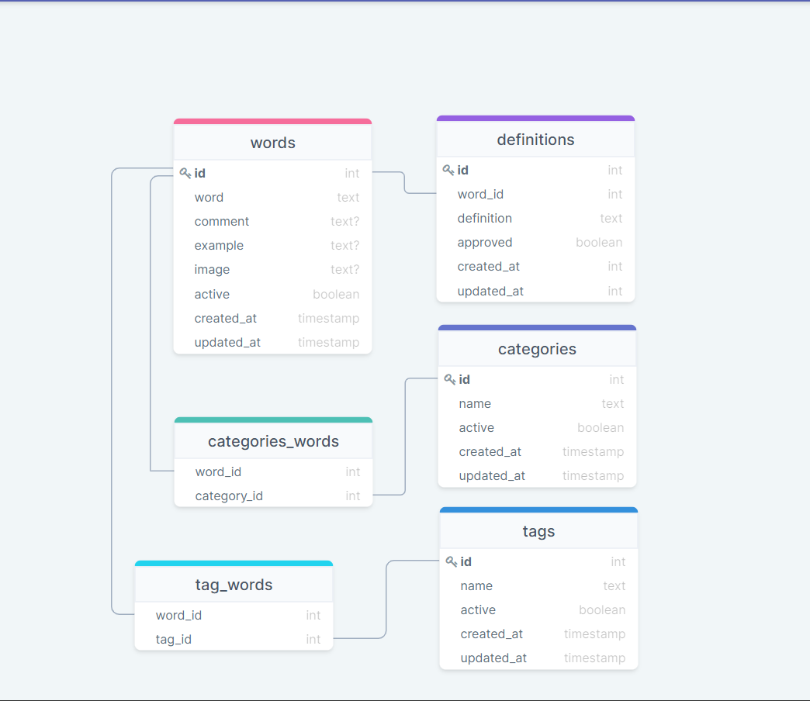

## Table of Contents

- [Table of Contents](#table-of-contents)
- [App looks like](#app-looks-like)
- [Package](#package)
- [Install And Run](#install-and-run)
- [Admin](#admin)
- [Database](#database)
- [Resources](#resources)

## App looks like



## Packages

| name                       | version |
| -------------------------- | ------- |
| backpack/crud              | ^5.2    |
| backpack/generators        | ^3.1    |
| backpack/permissionmanager | ^6.0    |

## Install And Run

Download [ZIP](https://github.com/piqasoo/dictionary_engine/archive/refs/heads/master.zip) project or Clone repository

```
https://github.com/LJ1319/Unilab-Dictionary.git
```

Composer install

```
composer i
```

Copy env file

```
cp .env.example .env
```

Set the application key

```
php artisan key:generate
```

Run the database migrations

```
php artisan migrate
```

Seed the database with records

```
php artisan db:seed
```

Create the symbolic links configured for the application

```
php artisan storage:link
```

> ⚠️ ℹ️ Information
> 
> Change APP_URL=http://localhost, specify the path where this project is running, for example:
> APP_URL=http://dictionary.test/ This is necessary to render the image

## Admin

Gain super Admin role and permissions by navigating to ```/admin/super-admin```

## Database



## Resources

* [DrawSql](https://drawsql.app/sopo/diagrams/dictionary-engine)
* [BackPack](https://backpackforlaravel.com/)
* [BackPack/permissionmanager](https://github.com/Laravel-Backpack/PermissionManager)
